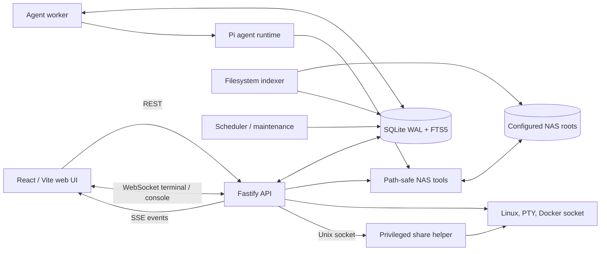

<p align="center">
  
</p>

<h1 align="center">SigmaOS</h1>

<p align="center">
  A local-first Linux NAS appliance with a web workspace, approval-gated AI operations, search, and host management.
</p>

SigmaOS is a single-user control plane for a personal Linux NAS. It combines a responsive file workspace with an AI agent, keeps state in a local SQLite database, and runs as a set of native `systemd` services instead of inside containers.

The project is an npm workspaces monorepo written in strict TypeScript. Its production target is Node.js 22 on Debian-based systems, with a React/Vite frontend and a Fastify API.

## Project status

SigmaOS is under active v1 development. The file workspace, agent job pipeline, approvals, indexing, Docker controls, share configuration, Debian packaging, and scheduled maintenance paths are implemented.

The following surfaces are intentionally limited today:

- Virtual machine management is a non-functional UI preview.
- Network and storage management are observational; the API does not apply host configuration.
- OCR is reserved as an indexer hook but is not implemented.
- Backup maintenance reports configuration state but does not perform backups.
- The appliance builder produces a generic root filesystem tarball, not a board-specific boot image.

## What is implemented

### File workspace

- Browse multiple configured NAS roots with breadcrumb navigation and Git status indicators.
- Search the SQLite FTS index with a filesystem name-search fallback.
- Incrementally refresh the index from file size and modification time without following symbolic links.
- Preview text, source code, Markdown, CSV/TSV, images, audio, video, and PDF files.
- Transcode unsupported browser video containers to a local MP4 cache with FFmpeg.
- Edit bounded text files with modification-time conflict detection.
- Upload files and folders, including drag-and-drop batches with progress and cancellation.
- Extract ZIP, TAR, TAR.GZ, GZIP, and RAR archives with traversal, symlink, entry-count, and expanded-size checks.
- Propose folder creation, rename, move, copy, and trash operations for explicit approval.
- Review operation history, restore quarantined files, and roll back supported operations.

### AI workspace

- Persistent chat sessions scoped to a NAS root, with independent workspace navigation state.
- A database-backed job queue processed by a separate worker.
- Pi agent integration with OpenAI, Anthropic, and compatible custom base URLs.
- Streaming job and tool activity over Server-Sent Events.
- Per-tool policy controls for `read`, `grep`, `find`, `ls`, `bash`, `edit`, and `write`.
- Approval records for dangerous Pi tool calls before execution.
- A model-free, read-only local fallback for development and testing.

### Host management

- Read-only CPU, memory, process, runtime, storage, SMART, RAID, mount, and network reporting.
- A local PTY terminal over WebSocket using the API service account.
- Optional Docker Engine and Compose discovery, metrics, logs, lifecycle actions, and one-time approved console sessions.
- Approval-gated SMB, WebDAV, FTP, NFS, and DLNA share configuration through a separate privileged helper.
- English and Simplified Chinese UI, light/dark themes, preview limits, and editor font settings.

### Native appliance services

- Debian package definitions for `amd64` and `arm64` release artifacts.
- Hardened `systemd` units for the API, worker, indexer, scheduler, maintenance, and share helper.
- Timers for indexing every 30 minutes, scheduled reports every 6 hours, and daily maintenance.
- A Debian Bookworm rootfs scaffold built with `mmdebstrap` and `systemd-nspawn`.

## Architecture



The main runtime components are:

| Component | Responsibility |
| --- | --- |
| `apps/web` | React 19 workspace UI, previews, settings, activity, and management panels. |
| `apps/api` | REST API, SSE event feed, WebSocket terminals, static production UI, and approved operation execution. |
| `apps/worker` | Claims queued jobs, runs agent turns, persists events, and pauses work for approvals. |
| `apps/indexer` | Walks NAS roots, hashes files, extracts bounded text, and maintains the FTS index. |
| `apps/scheduler` | Generates duplicate, backup, provider, and health reports; checkpoints and optimizes SQLite. |
| `apps/share-helper` | Applies approved host share configuration through a restricted Unix socket service. |
| `packages/agent` | Pi SDK integration, NAS-scoped tools, session persistence, and tool policy enforcement. |
| `packages/db` | SQLite connection, migrations, repositories, job queue, approvals, operations, and FTS queries. |
| `packages/nas-tools` | Root-relative path validation, symlink escape protection, file reads, metadata, and mutations. |
| `packages/shared` | Configuration loading and shared domain/API types. |

### Agent and approval flow

1. The browser creates a session message through the API.
2. The API stores the message and a queued job in SQLite.
3. The worker claims the job and starts a Pi agent turn scoped to the selected NAS root.
4. Agent and tool events are appended to SQLite and streamed to the browser over SSE.
5. A policy-gated tool call or proposed mutation creates a pending approval and pauses execution.
6. The API applies or rejects the operation after the user acts, then records the outcome for audit and rollback.

File operations proposed through the workspace or agent, Pi tool calls, Docker operations, and share-service changes use this approval path. Direct UI uploads, text saves, and archive extraction are applied immediately but are still path-checked and recorded in operation history.

## Security model

SigmaOS currently assumes a trusted, single-user appliance. It has no multi-user authentication boundary and binds the API to `127.0.0.1` by default. Do not expose it directly to an untrusted network.

- Every NAS file path is resolved relative to a configured root; absolute paths, traversal, and unsafe symlink escapes are rejected.
- File-oriented agent tools use NAS-root-scoped SigmaOS wrappers. The `bash` tool is a real service-account shell, is always approval-gated, and is not a filesystem sandbox.
- Write-capable Pi tools default to approval or disabled policies, configurable from the UI.
- Approved file changes are audited. Trash uses a SigmaOS-managed quarantine area, and v1 never permanently deletes it during maintenance.
- Docker management is disabled by default. Access to `/var/run/docker.sock` is effectively root-equivalent.
- The local terminal is a real shell running as the API service account and should be treated as privileged access.
- Share changes are isolated in `apps/share-helper`, which writes allowlisted host configuration files and reloads allowlisted services.

Always configure at least one explicit NAS root. When no root is provided, the development fallback is the host filesystem root.

## Requirements

For application development:

- Node.js 22 or newer
- npm (the version bundled with Node.js 22 is supported)
- A compiler toolchain supported by the native `better-sqlite3` and `node-pty` dependencies when prebuilt binaries are unavailable

Optional host tools enable additional features:

| Feature | Host dependencies |
| --- | --- |
| Git status | `git` |
| Video transcoding | `ffmpeg` |
| Archive extraction | `gzip`, `unzip`, `tar`, `bsdtar`, or `unrar` as appropriate |
| Storage and network inspection | `ip`, `lsblk`, `findmnt`, `mdadm`, `smartctl` |
| Share management | Samba, Apache WebDAV, vsftpd, NFS server, MiniDLNA, and the packaged share helper |
| Docker management | Docker Engine socket access and the Docker CLI for Compose actions |

## Local development

Install dependencies, create an isolated development NAS root, and export the configuration read by the Node.js processes:

```bash
npm install
mkdir -p .sigmaos/dev-nas
export SIGMAOS_DATA_DIR="$PWD/.sigmaos"
export SIGMAOS_NAS_ROOTS="dev:Development NAS:$PWD/.sigmaos/dev-nas"
npm run dev
```

Open [http://127.0.0.1:5173](http://127.0.0.1:5173). Vite proxies `/api`, `/health`, and WebSocket traffic to the API at `127.0.0.1:3010`.

`npm run dev` starts the API, agent worker, and web UI. The indexer and scheduled tasks remain explicit during development:

```bash
npm run index
npm run schedule
npm run maintenance
```

The packaged `sigmaos-indexer.timer` runs every 30 minutes, so search is eventually consistent after uploads, edits, moves, and deletes. Run `npm run index` for an immediate development refresh. A failed file retains its last successful index entry, and an incomplete directory traversal does not remove stale entries that could not be verified.

Inspect the latest run for every configured root, or one root, through the read-only status endpoint:

```bash
curl http://127.0.0.1:3010/api/indexer/status
curl "http://127.0.0.1:3010/api/indexer/status?rootId=dev"
```

Status responses include scan, reindex, unchanged, removal, skip, and failure counts plus root-relative failure paths. Symbolic links are always skipped. OCR, PDF/Office content extraction, real-time filesystem watchers, and mutation-triggered reindexing remain outside the v1 indexer baseline.

Configure an OpenAI or Anthropic provider, model, and API key in **Settings > Model Providers** before starting an AI turn. Provider secrets are stored in the local SQLite database; API reads only report whether a key is configured.

For a model-free read-only development agent, set this before starting the worker:

```bash
export SIGMAOS_ENABLE_LOCAL_AGENT_FALLBACK=1
```

The backend reads process environment variables directly; `.env.example` is a reference file and is not automatically loaded by the Node.js services.

## Configuration

Production services read TOML from `/etc/sigmaos/config.toml`. Override the location with `SIGMAOS_CONFIG`. See [`config.example.toml`](config.example.toml) and [`packaging/etc/config.toml`](packaging/etc/config.toml) for the supported baseline.

A minimal configuration is:

```toml
data_dir = "/var/lib/sigmaos"

[api]
host = "127.0.0.1"
port = 3010
allowed_origins = []

[worker]
poll_ms = 750

[docker]
enabled = false
socket_path = "/var/run/docker.sock"
compose_command = "docker"
operation_timeout_ms = 120000
console_shells = ["/bin/sh", "/bin/bash"]

[shares]
enabled = false
helper_socket_path = "/run/sigmaos/share-helper.sock"
account_username = "sigma-share"

[[nas_roots]]
id = "primary"
name = "Primary NAS"
path = "/srv/nas"
```

Environment variables override the corresponding TOML values. The most useful development overrides are `SIGMAOS_DATA_DIR`, `SIGMAOS_DATABASE_PATH`, `SIGMAOS_API_HOST`, `SIGMAOS_API_PORT`, `SIGMAOS_ALLOWED_ORIGINS`, `SIGMAOS_NAS_ROOTS`, and the `SIGMAOS_DOCKER_*` variables documented in [`.env.example`](.env.example).

## Build and verification

```bash
npm run typecheck
npm run lint
npm test
npm run build
```

The equivalent Make targets are available through `make check` and `make ci`. The production API serves `apps/web/dist` when it is present, so a source build can be run with the API and worker in separate shells:

```bash
npm run start -w @sigmaos/api
npm run start -w @sigmaos/worker
```

## Debian package and appliance image

On a Debian or Ubuntu build host with Node.js 22, `build-essential`, `debhelper`, `dpkg-dev`, `fakeroot`, and `rsync` installed:

```bash
make deb
```

Package artifacts are written under `.sigmaos/`. The package installs the built applications under `/usr/lib/sigmaos`, configuration under `/etc/sigmaos`, persistent state under `/var/lib/sigmaos`, and the service units under `/lib/systemd/system`.

To build the generic Debian Bookworm rootfs tarball, install `mmdebstrap`, `systemd-nspawn`, and `tar`, then point the appliance builder at the architecture-matching package:

```bash
SIGMAOS_DEB=/absolute/path/to/sigmaos_0.1.0_arm64.deb make appliance
```

See [`packaging/appliance/README.md`](packaging/appliance/README.md) for image-builder inputs. Tagged releases are configured to publish `amd64` and `arm64` Debian artifacts with checksums through GitHub Actions.

## Repository layout

```text
apps/
  api/            Fastify API and host adapters
  indexer/        NAS scanner and SQLite FTS indexer
  scheduler/      Reports and database maintenance
  share-helper/   Privileged share configuration service
  web/            React/Vite user interface
  worker/         Agent job processor
packages/
  agent/          Pi runtime and policy-gated tools
  db/             SQLite schema and repositories
  nas-tools/      Path-safe NAS operations
  shared/         Configuration and shared types
packaging/
  appliance/      Rootfs image scaffold
  debian/         Debian package metadata
  systemd/        Runtime services and timers
docs/             Capability and specification coverage notes
```

## License

Licensed under the [Apache License 2.0](LICENSE).
