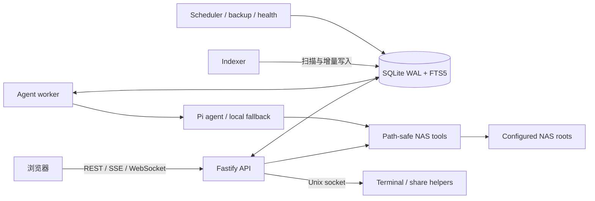

```mermaid
flowchart LR
  Browser[浏览器] -->|REST / SSE / WebSocket| API[Fastify API]
  API <--> DB[(SQLite WAL + FTS5)]
  API --> Tools[Path-safe NAS tools]
  Worker[Agent worker] <--> DB
  Worker --> Agent[Pi agent / local fallback]
  Agent --> Tools
  Indexer[Indexer] -->|扫描与增量写入| DB
  Scheduler[Scheduler / backup / health] --> DB
  API -->|Unix socket| Helpers[Terminal / share helpers]
  Tools --> NAS[Configured NAS roots]
```

依赖方向是 `web -> api`，`api -> db/nas-tools/shared`，`worker -> agent/db/shared`，而 indexer、backup、scheduler 直接共享 SQLite 和配置包。SigmaOS 是多进程原生服务，不使用 Docker 作为自身部署边界。
