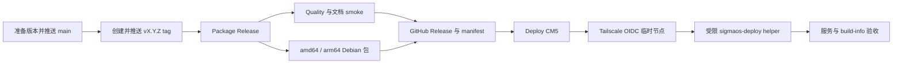

本流程从稳定的 `vX.Y.Z` tag 构建 `amd64` 与 `arm64` Debian 包，创建可校验的 GitHub Release，再由独立 workflow 通过 Tailscale 把 `arm64` 包部署到家庭网络中的 CM5。CM5 不需要公网 IP、端口转发、GitHub self-hosted runner 或保存在 GitHub 中的主机密码。



## Workflow 职责

| Workflow | 触发条件 | 职责 | 生产凭据 |
| --- | --- | --- | --- |
| `Package Release` | Pull Request、`main` push、`v*` tag push | 质量检查、双架构打包、文档浏览器 smoke；tag 时创建 Release | 不加载 |
| `Deploy CM5` | `Package Release` 完成或手动输入 tag | 选择可信 Release、连接 tailnet、调用 CM5 helper、部署后验收 | 仅 `deploy` job 通过 `production` environment 加载 |

PR 和 `main` push 也会运行打包，以尽早发现原生依赖或 Debian 规则问题，但不会创建 Release。它们触发的 `Deploy CM5` run 会在 `select-release` job 中正常结束为空操作。只有来自当前仓库、成功完成且分支名为稳定 `vX.Y.Z` tag 的上游 run 才进入自动部署。

## 一次性配置

### 1. 初始化 CM5

CM5 应运行 Debian 12/bookworm arm64 或已在目标机验证的兼容系统，并已经安装当前 SigmaOS Debian 包和 Tailscale。给设备分配 `tag:sigmaos-cm5`，然后从本地控制台或现有维护连接执行：

```bash
sudo tailscale set --ssh
sudo /usr/lib/sigmaos/scripts/sigmaos-deploy-bootstrap.sh
```

bootstrap 会：

- 创建锁定密码的系统用户 `sigmaos-deploy`；
- 创建组可写但不可列目录的 `/var/lib/sigmaos-deploy/incoming/`；
- 创建 root-only 的 release 和 backup 目录；
- 将包内 helper 链接为 `/usr/local/sbin/sigmaos-deploy`；
- 只允许部署用户免密执行这个固定 helper，不授予通用 root shell。

确认权限：

```bash
id sigmaos-deploy
sudo -l -U sigmaos-deploy
sudo stat -c '%U:%G %a %n' \
  /usr/local/sbin/sigmaos-deploy \
  /var/lib/sigmaos-deploy/incoming
```

### 2. 限制 Tailnet 访问

在现有 Tailscale policy 中合并以下最小权限；保留 tailnet 已有的其他规则：

```json
{
  "tagOwners": {
    "tag:github-actions": ["autogroup:admin"],
    "tag:sigmaos-cm5": ["autogroup:admin"]
  },
  "acls": [
    {
      "action": "accept",
      "src": ["tag:github-actions"],
      "dst": ["tag:sigmaos-cm5:22"]
    }
  ],
  "ssh": [
    {
      "action": "accept",
      "src": ["tag:github-actions"],
      "dst": ["tag:sigmaos-cm5"],
      "users": ["sigmaos-deploy"]
    }
  ]
}
```

不要把 `tag:github-actions` 的所有权授予普通成员或其他设备。部署目标必须使用 Tailscale MagicDNS 名称或 `100.x.y.z` 地址，不使用家庭 LAN 地址。

### 3. 配置 Tailscale Workload Identity Federation

在 Tailscale admin console 创建 GitHub Actions trust credential：

- issuer：`https://token.actions.githubusercontent.com`；
- subject：`repo:zhubby@9190779/SigmaOS@1341473177:environment:production`；
- scope：允许创建 auth key；
- tag：仅 `tag:github-actions`。

subject 使用 GitHub 返回的稳定 owner/repository ID，而不是可改名的显示名称。`.github/workflows/deploy-cm5.yml` 会在连接前校验相同 subject、issuer 和 audience；仓库转移、重建或修改 environment 名称时，必须同时更新 trust credential 与 workflow 中的 `EXPECTED_SUBJECT`。

### 4. 配置 GitHub production environment

在仓库的 `production` environment 中设置：

| 类型 | 名称 | 值 |
| --- | --- | --- |
| Secret | `TS_OAUTH_CLIENT_ID` | Tailscale trust credential 的 client ID |
| Secret | `TS_AUDIENCE` | `api.tailscale.com/<TS_OAUTH_CLIENT_ID>` |
| Variable | `CM5_HOST` | CM5 的 MagicDNS hostname 或 Tailscale IP |
| Variable | `CM5_DEPLOY_USER` | `sigmaos-deploy` |

首次上线可以给 environment 配置 required reviewer；稳定后可按发布策略决定是否保留审批。不要添加 SSH 私钥、登录密码或 root 密码。部署 job 只需要 `contents: read`、`actions: read` 和 `id-token: write`。

## 发布新版本

从干净且已同步的 `main` 开始。以下示例发布一个 patch 版本：

```bash
git switch main
git pull --ff-only origin main
npm run release -- patch --note "Describe the operator-visible change"
npm run version:check
make ci
git diff --check
```

`npm run release` 会同步根 manifest、workspaces、Debian changelog 和 appliance manifest，但不会提交、打 tag 或推送。检查版本差异后提交并先推送 `main`：

```bash
VERSION="$(node -p 'require("./package.json").version')"
git add package.json package-lock.json apps packages packaging
git commit -m "chore(release): v${VERSION}"
git push origin main
```

等待 `main` 上的 `Package Release` 全部通过，再创建精确的 annotated tag：

```bash
git tag -a "v${VERSION}" -m "v${VERSION}"
git push origin "v${VERSION}"
```

不要移动或复用已发布 tag。tag 必须与 Debian changelog 版本一致，并指向 `origin/main` 可达的提交，否则 Release job 会拒绝发布。

## Package Release 做了什么

1. `Quality` 使用 Node.js 22 运行版本策略、typecheck、lint、test 和完整 build。
2. `Package (amd64)` 在 Ubuntu runner 构建并检查 Debian 产物。
3. `Package (arm64)` 在原生 ARM64 runner 的固定 `node:22-bookworm` 容器中构建，确保 `better-sqlite3` 原生模块和 Rust hostd/termux 二进制匹配 CM5。
4. `Documentation browser smoke` 构建文档并用 Chromium 检查导航、搜索与页面渲染。
5. tag run 在上述 job 全部成功后创建 GitHub Release，包含两个架构的 `.deb`、`.changes`、`.buildinfo`、`SHA256SUMS` 和 `release-manifest.json`。

`release-manifest.json` 是 CM5 部署的最小可信描述：

```json
{
  "repository": "zhubby/SigmaOS",
  "tag": "vX.Y.Z",
  "version": "X.Y.Z",
  "commitSha": "<40-character commit SHA>",
  "architecture": "arm64",
  "asset": "sigmaos_X.Y.Z_arm64.deb",
  "sha256": "<64-character SHA256>"
}
```

所有第三方 Actions 都固定到完整 commit SHA。Release job 还要求 tag 位于 `main` 历史中，并再次检查 tag、Debian 版本、资产名称和 checksum。

## Deploy CM5 做了什么

`select-release` 不加载生产 secrets。它先验证上游事件或手动 tag，再下载 manifest 与 Release asset，并检查 repository、tag、commit、SemVer、文件名、SHA256、Debian 版本和 `arm64` 架构。

通过选择后，`deploy` job：

1. 进入 `production` environment，并验证 GitHub OIDC claims；
2. 使用 `tailscale/github-action@v4` 创建带 `tag:github-actions` 的临时节点；
3. 经 Tailscale SSH 上传 `release-manifest.json`，并用 SFTP 将 package 切成可独立续传的分片；CM5 按顺序拼接并校验完整 SHA256 后，再原子替换 staging 中的 `package.deb`；
4. 执行 `sudo -n /usr/local/sbin/sigmaos-deploy`；
5. 再次检查常驻服务、failed units、API liveness、root readiness、system health，以及 build-info 的版本和 commit；
6. workflow 结束时 logout 并清理临时 Tailscale 节点。

`concurrency: cm5-production` 串行化所有生产部署，且不会取消正在进行的升级。

## CM5 helper 的升级语义

helper 用 `flock` 阻止并发执行，并在离开可写 staging 后重新校验普通文件、manifest、checksum、版本和架构。

- 目标版本低于已安装版本时拒绝降级。
- 版本相同但 commit 不同时拒绝覆盖。
- 版本和 commit 都相同时不重装，只重新验证服务和 build-info，因此可安全重试同一个 tag。
- 正常升级会保存原 service/timer 状态，停止 SQLite/NAS writers，备份 `/etc/sigmaos` 和 `/var/lib/sigmaos`，再执行 `dpkg -i`。
- 安装后只恢复升级前实际启用或运行的服务与 timers，并执行完整运行时检查。

成功记录写入 `/var/lib/sigmaos-deploy/current-release.json`，已验证包保存在 `/var/lib/sigmaos-deploy/releases/<tag>/`。升级失败时，备份、旧包引用和诊断日志保留在 `/var/lib/sigmaos-deploy/backups/<tag>-<timestamp>/`，部署程序会尽力恢复此前的 systemd 状态。

部署程序不自动回滚 Debian 包或数据库 migration。schema 变化后的回滚必须使用与旧包匹配的状态备份，不能只重新安装旧 `.deb`。

## 观察、验证与手动重试

查看流水线：

```bash
gh run list --workflow package-release.yml --limit 5
gh run list --workflow deploy-cm5.yml --limit 5
gh run watch <run-id> --exit-status
```

部署成功后在 CM5 核对：

```bash
sudo systemctl --failed
sudo systemctl is-active \
  sigmaos-api.service sigmaos-worker@1.service \
  sigmaos-downloader.service sigmaos-hostd.service \
  sigmaos-termux.service
curl -fsS http://127.0.0.1:3010/health
curl -fsS http://127.0.0.1:3010/api/roots/readiness
curl -fsS http://127.0.0.1:3010/api/system/health
curl -fsS http://127.0.0.1:3010/api/system/build-info
sudo cat /var/lib/sigmaos-deploy/current-release.json
```

自动部署失败但 Release 正确时，从默认分支上的当前 workflow 实现重试原 tag：

```bash
gh workflow run deploy-cm5.yml --ref main -f tag=vX.Y.Z
```

传输中断时，CM5 会保留 SHA256 命名的分片目录；从 `main` 重试同一个 tag 时，完整分片会先校验大小和 SHA256，较小分片从已有字节继续上传，最多四片并行。所有分片拼接且 checksum 匹配后，临时文件会原子替换为 `package.deb`，因此成功部署后的再次重试仍可能重新传输完整 package。若 GitHub runner 与 CM5 只能经 DERP 通信，上传可能需要数分钟。日志出现 `version X.Y.Z is already installed; verifying runtime only` 表示命中幂等验证分支。

## 常见失败

- **Release 没有创建**：先检查 Quality、两个 package job 和 documentation smoke；任一失败都会阻止 Release。
- **Deploy run 成功但没有 deploy job**：PR 或 `main` push 的上游 run 会按设计成为空操作，确认触发来源是否为稳定 tag。
- **manifest validation failed**：下载 Release 中的 `release-manifest.json`，检查字段是否为字符串且与 tag、asset 和 checksum 一致。
- **unexpected GitHub OIDC subject**：从预检日志读取实际 claims；确认 GitHub environment 和 Tailscale trust credential 使用同一个稳定 subject，不要放宽为通配符。
- **Tailscale ping 只走 DERP**：功能不受影响，但 package 上传更慢；不要因此改用公网 SSH 或家庭 LAN 地址。
- **helper 拒绝降级或同版本不同 commit**：发布一个更高的 SemVer；不要移动 tag 或绕过校验。
- **部署后健康检查失败**：保留 helper backup 和 journal，停止扩大部署；数据库发生 migration 时不要盲目安装旧包。

更通用的安装、冷备份和恢复边界见[Debian 与 appliance 部署](/docs/operations/deployment/)；CM5 硬件与运行时验收见[Raspberry Pi CM5 部署](/docs/operations/cm5/)。
